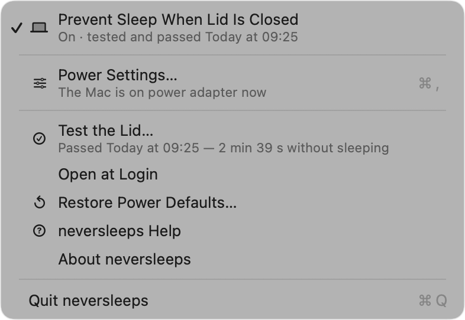
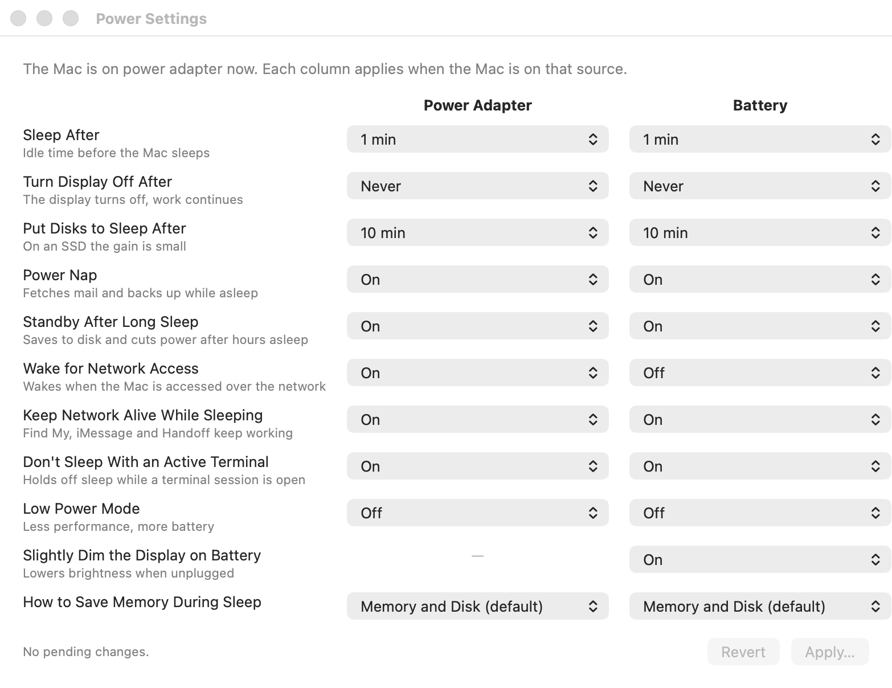

# neversleeps: keep your MacBook awake with the lid closed

**Run Claude Code, builds, downloads or any long terminal task with the MacBook closed, in a bag.** A menu bar app for macOS that turns the lid-closed sleep lock on and off with one click, and then *proves* it works.

[](https://github.com/philipecomputacao/neversleeps/releases/latest)
[](https://github.com/philipecomputacao/neversleeps/actions/workflows/build.yml)
[](#install)
[](LICENSE)

**Site:** [philipecomputacao.github.io/neversleeps/en](https://philipecomputacao.github.io/neversleeps/en/) · **Português:** [README.pt-BR.md](README.pt-BR.md), *usar o Claude com o MacBook fechado, sem o Mac dormir.*

## Install

One line, downloads the latest release, **verifies the sha256**, installs to `/Applications` and opens. No `sudo`.

```bash
curl -fsSL https://raw.githubusercontent.com/philipecomputacao/neversleeps/main/install.sh | bash
```

<details>
<summary>Other ways</summary>

**Homebrew** (third-party taps must be trusted before tapping):

```bash
brew trust philipecomputacao/neversleeps
brew tap philipecomputacao/neversleeps
brew install --cask neversleeps
```

**Manual:** download the `.zip` from [Releases](https://github.com/philipecomputacao/neversleeps/releases/latest), unzip, drag `neversleeps.app` to Applications. First launch: **right-click → Open** (once), the app is not notarized by Apple yet.

**From source** (macOS 14+, Command Line Tools only, no Xcode):

```bash
git clone https://github.com/philipecomputacao/neversleeps.git && cd neversleeps && bash construir.sh
```
</details>

## Use Claude Code with the MacBook closed

This is the situation the app was built for. Three things have to be true, and only the first one is the app's job:

1. **The Mac must not sleep when closed.** Click the cup in the menu bar → **Prevent Sleep When Lid Is Closed** → Touch ID. The cup fills up. That's the whole gesture.
2. **It needs internet while closed.** Let the iPhone join automatically: *System Settings → Wi-Fi → Personal Hotspot → Automatically*. Claude Code retries when the network comes back.
3. **Heat.** A Claude Code session is light, the Mac spends its time waiting on the API. Heavy builds or looping tests inside a closed bag are not.

Then click **Test the Lid…**, close the Mac for one minute, open it. The app reads the system log (`pmset -g log`) and its own heartbeat and shows the verdict. Until a test passes, the lock line says *"On · not tested yet"*, **on is not the same as proven.**

<p align="center"></p>

## What it does

| I want to | Do this |
|---|---|
| Work with the lid closed | Click the cup → **Prevent Sleep When Lid Is Closed** |
| Know it's on without clicking | **Full cup** = lock on · **empty cup** = normal sleep |
| Be sure it actually works | **Test the Lid…** (1 minute, real verdict) |
| Change other power settings | **Power Settings…** (⌘,), power adapter and battery side by side, one authentication for all changes |

<p align="center"></p>
| Start with the Mac | **Open at Login** |
| Undo everything | **Restore Power Defaults…** |

## Why not `caffeinate` or Amphetamine?

- `caffeinate` prevents *idle* sleep. Closing the lid overrides it, the Mac sleeps anyway. neversleeps sets `pmset disablesleep`, the only switch that survives the lid.
- Amphetamine can do it (Closed-Display Mode), but it is one option among dozens, and nothing tells you whether it actually held. neversleeps is one toggle, and it tests itself.
- `sudo pmset -a disablesleep 1` in Terminal works, that's exactly what the app runs. The app adds: a visible state in the menu bar, one-click on/off, a real test, and a reminder if you close the Mac with the lock off.

## How it works

- **Reads the real state** with `pmset -g`, `pmset -g custom` and `pmset -g batt` every time the menu opens. Never caches it, change something in Terminal and the menu tells the truth.
- **Writes** with `pmset` as root through **macOS's own authentication dialog** (Touch ID / password), one authentication per change. No `sudoers` rule, no privileged helper, nothing with root left behind.
- **Re-reads after every write.** If macOS accepted the command but ignored the value, you're told.
- **No network. No telemetry.** Nothing leaves your machine. ([SECURITY.md](SECURITY.md))

```bash
/Applications/neversleeps.app/Contents/MacOS/neversleeps --estado        # what the app reads
/Applications/neversleeps.app/Contents/MacOS/neversleeps --repousos 60   # sleep events, last 60 min
```

## Uninstall

```bash
curl -fsSL https://raw.githubusercontent.com/philipecomputacao/neversleeps/main/desinstalar.sh | bash
```

**The lid lock is a macOS setting and does not go away with the app.** The uninstaller asks whether to restore power defaults.

## Development

Swift Package, two targets: `NeversleepsCore` (no AppKit, tested with real `pmset` output) and the app. `swift build` · `swift run verificar` · `bash construir.sh` · `bash publicar.sh`. Interface in English and Portuguese (Brazil), following the system language. See [CONTRIBUTING.md](CONTRIBUTING.md) and the maintenance notes in [AGENTS.md](AGENTS.md).

Tested on Apple Silicon, macOS 26. Requires macOS 14+.

## License

[MIT](LICENSE) · © 2026 LP Digital ([lpdigital.me](https://lpdigital.me))

<sub>Keywords: keep MacBook awake lid closed · run Claude Code with laptop closed · macOS prevent sleep clamshell · pmset disablesleep menu bar · caffeinate alternative lid closed · MacBook fechado não dormir · usar Claude com o notebook fechado</sub>
